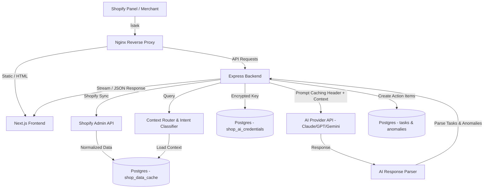
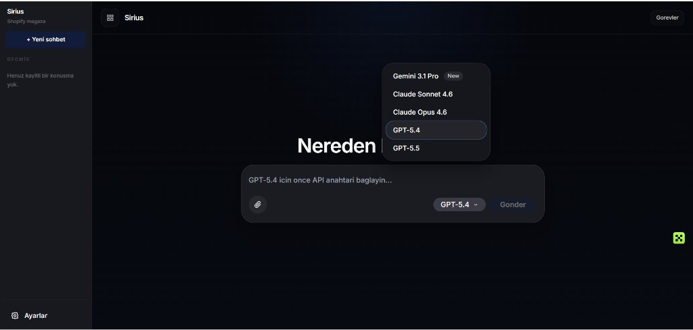
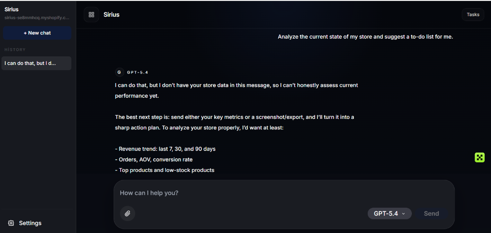

# Sirius - Shopify Embedded AI Assistant

Sirius, Shopify mağaza sahipleri için satış analizi, anomali tespiti ve yapay zeka destekli operasyonel rehberlik sunan gömülü (embedded) bir yapay zeka asistanıdır.

## Problem
E-ticaret mağaza sahipleri; devasa miktardaki günlük satış, stok ve sipariş verilerini sürekli analiz edip kritik operasyonel kararları (reklam bütçeleri, stok yenileme esikleri, beklenmeyen satış dalgalanmaları ve ciro kayıpları) zamanında almakta zorlanmaktadır. Mevcut analitik araçları karmaşık tablolar sunmakta, ancak bu verilerden doğrudan aksiyona dökülebilir kararlar üretmekte yetersiz kalmaktadır.

## Solution
Sirius, Shopify yönetim paneline doğrudan gömülerek mağaza verilerini arka planda otomatik olarak senkronize eder ve optimize edilmiş bir önbellekte tutar. Gelişmiş niyet analizi (Context-Aware Routing) sayesinde kullanıcının sorgusuna göre sadece ilgili verileri filtreleyip LLM modellerine besler. Merchant'ın kendi API anahtarlarını (Claude, GPT, Gemini) kullanarak verileri üzerinde konuşmasını sağlar, anormallikleri tespit eder ve doğrudan uygulanabilir bir görev (Task) planı hazırlar.

## My Role
- **Product Thinking:** Mağaza sahiplerinin karar verme süreçlerini kolaylaştırmak üzere anomali tespiti ve otomatik görev oluşturma odaklı asistan deneyiminin kurgulanması.
- **Technical Implementation:** Next.js frontend, Express.js backend ve PostgreSQL veritabanı mimarisinin uçtan uca kurulması.
- **AI/LLM Workflow Design:** Prompt Caching (`PROMPT_CACHE_BOUNDARY`) mimarisinin geliştirilmesi, token optimizasyonları ve modüler skill sisteminin (`.skill`) tasarlanması.
- **Backend/Frontend/Database Work:** Şifrelenmiş API anahtarı depolama (`AES-256-GCM`), niyet sınıflandırma (Context Router), çoklu model desteği (AI Router) ve dosya ekleri analizi.
- **Coordination Between Business and Technical Needs:** Shopify native billing (faturalandırma) entegrasyonu, GDPR webhook standartları ve uygulamanın Shopify App Store listeleme kurallarına uygun hale getirilmesi.

## Key Features
- **Multi-Model Orchestration:** Claude 3.5 Sonnet/Opus, GPT-4o/5, Gemini 1.5/2.0 Pro modellerinin tüccarın kendi API anahtarlarıyla çalışabilmesi.
- **Context-Aware Routing & Pruning:** Gelen sorgunun niyetine göre (stok, satış, anomali vb.) mağaza verilerinin otomatik olarak filtrelenip optimize edilerek LLM'e gönderilmesi.
- **Prompt Caching & Cost Reduction:** Statik prompt kısımları ile dinamik mağaza verilerinin ayrıştırılması sayesinde API maliyetlerinde %80'e varan tasarruf sağlanması.
- **Automated Task & Anomaly Extraction:** Yapay zekanın verdiği yanıtlardan otomatik olarak anomali kayıtları ve yapılacak işler (Tasks) oluşturulması ve Postgres'e yazılması.
- **Safe Attachment Processing:** CSV, PDF, Word, Görsel ve ZIP dosyalarının yüklenip analiz edilebilmesi.

## Tech Stack
- **Frontend:** Next.js (React), TailwindCSS, TypeScript, Zustand, Shopify App Bridge v3
- **Backend:** Node.js, Express.js, pg (node-postgres), Axios, JWT, Multer
- **Database:** PostgreSQL 15
- **AI:** Anthropic SDK, OpenAI SDK, Google Generative AI SDK (Claude 3.5 Sonnet, GPT-4o, Gemini 2.0 Pro)
- **Deployment:** Docker & Docker Compose, Nginx (Reverse Proxy)
- **Integrations:** Shopify REST/GraphQL Admin API, Shopify Billing API, GDPR Webhook API

## Architecture
Sirius, monolitik bir Docker compose yapısı altında çalışan Next.js frontend ve Express backend mimarisine sahiptir. 



## Screenshots
- **Dashboard & Model Selection:**
  
- **AI Chat & Interface:**
  


## How to Run

### 1. Yerel Ortam Değişkenleri (`.env`)
Proje kök dizininde bir `.env` dosyası oluşturarak gerekli değişkenleri tanımlayın:
```env
SHOPIFY_API_KEY=your_shopify_api_key
SHOPIFY_API_SECRET=your_shopify_api_secret
SHOPIFY_APP_HANDLE=your-app-handle
JWT_SECRET=super_secret_jwt_key
ENCRYPTION_KEY=32_character_encryption_key_here_!!!
APP_URL=https://your-dev-tunnel.trycloudflare.com
DB_PASSWORD=sirius_secure_postgres_pass
NODE_ENV=development
AI_DEVELOPMENT_FALLBACK=true
SHOPIFY_BILLING_TEST_MODE=true
```

### 2. Docker ile Çalıştırma
Tüm servisleri ayağa kaldırmak için şu komutu çalıştırın:
```bash
docker compose up -d --build
```
Bu komut sırasıyla PostgreSQL, Backend API, Next.js Frontend ve Nginx Proxy servislerini ayağa kaldıracaktır.

### 3. Shopify Entegrasyonu
Shopify CLI üzerinden uygulamayı geliştirme mağazanız ile ilişkilendirin:
```bash
shopify app dev --config dev
```

## Security / Privacy
- **AES-256-GCM Şifreleme:** Merchant API anahtarları veritabanında (`shop_ai_credentials`) güçlü bir şifreleme algoritması ile saklanır.
- **Veri Anonimleştirme:** Sipariş verilerindeki kişisel müşteri bilgileri (isim, adres vb.) LLM API'lerine gönderilmeden önce backend katmanında temizlenir.
- **Tenant Isolation:** Çoklu kiracılık (multi-tenancy) mimarisi ile her mağazanın verisi JWT tabanlı session kontrolleri ile izole edilmiştir.
- **No Secrets Committed:** `.env` dosyası ve hassas konfigürasyonlar `.gitignore` ile korunmaktadır ve asla repoya commit edilmez.

## Status
Active Development / Production Pilot
